# 0. Загружаем библиотеки

```r
#install.packages(c('dplyr', 'ggplot2'))
#install.packages('openxlsx')
library(dplyr)
library(ggplot2)
#install.packages('ggpubr')
library(ggpubr)
```

# 1. Загрузим данные для работы
Это  данные по базовым показателям здоровья индивида и сумме, которую страховая  компания заплатила за его лечение в год. 

```r
insurance_cost <- read.csv('data/insurance_cost.csv', stringsAsFactors = T)
# Можно загрузить точно такие же данные, но в формате Excel
#pima1 <- openxlsx::read.xlsx('pima.xlsx')

head(insurance_cost)
```

```
##   age    sex    bmi children smoker    region   charges
## 1  19 female 27.900        0    yes southwest 16884.924
## 2  18   male 33.770        1     no southeast  1725.552
## 3  28   male 33.000        3     no southeast  4449.462
## 4  33   male 22.705        0     no northwest 21984.471
## 5  32   male 28.880        0     no northwest  3866.855
## 6  31 female 25.740        0     no southeast  3756.622
```

Посмотрим на данные:

```r
#install.packages("skimr")
library(skimr)
skim(insurance_cost)
```


Table: Data summary

|                         |               |
|:------------------------|:--------------|
|Name                     |insurance_cost |
|Number of rows           |1338           |
|Number of columns        |7              |
|_______________________  |               |
|Column type frequency:   |               |
|factor                   |3              |
|numeric                  |4              |
|________________________ |               |
|Group variables          |None           |


**Variable type: factor**

|skim_variable | n_missing| complete_rate|ordered | n_unique|top_counts                             |
|:-------------|---------:|-------------:|:-------|--------:|:--------------------------------------|
|sex           |         0|             1|FALSE   |        2|mal: 676, fem: 662                     |
|smoker        |         0|             1|FALSE   |        2|no: 1064, yes: 274                     |
|region        |         0|             1|FALSE   |        4|sou: 364, nor: 325, sou: 325, nor: 324 |


**Variable type: numeric**

|skim_variable | n_missing| complete_rate|     mean|       sd|      p0|     p25|     p50|      p75|     p100|hist  |
|:-------------|---------:|-------------:|--------:|--------:|-------:|-------:|-------:|--------:|--------:|:-----|
|age           |         0|             1|    39.21|    14.05|   18.00|   27.00|   39.00|    51.00|    64.00|▇▅▅▆▆ |
|bmi           |         0|             1|    30.66|     6.10|   15.96|   26.30|   30.40|    34.69|    53.13|▂▇▇▂▁ |
|children      |         0|             1|     1.09|     1.21|    0.00|    0.00|    1.00|     2.00|     5.00|▇▂▂▁▁ |
|charges       |         0|             1| 13270.42| 12110.01| 1121.87| 4740.29| 9382.03| 16639.91| 63770.43|▇▂▁▁▁ |


# 2. Гистограммы всех нумерических переменных 

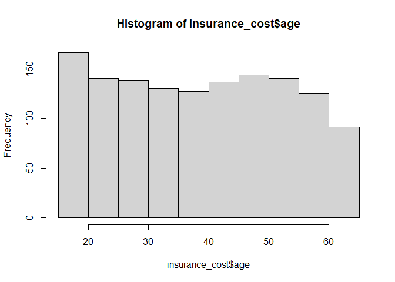<!-- -->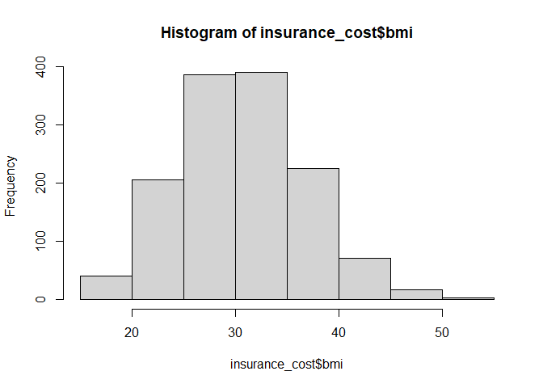<!-- -->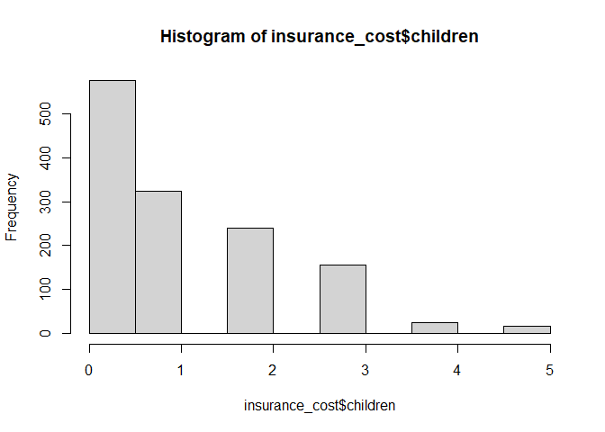<!-- -->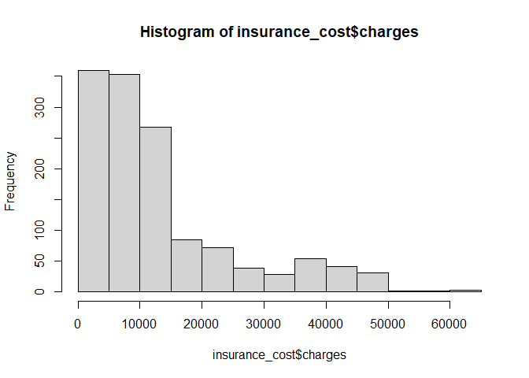<!-- -->

# 3. Графики плотности по колонке charges
Вертикальные линии средней и медианы на графике отмечены красным и зеленым цветом соответственно. 


```r
# Найдём среднюю
charges_mean <- round(mean(insurance_cost$charges),1)

# Найдем медиану
charges_median <- round(median(insurance_cost$charges),1)


ggplot(data = insurance_cost, 
       aes(x = charges)) +
  geom_histogram(bins = 50) 
```

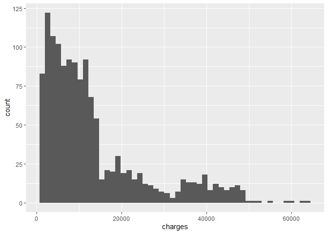<!-- -->

```r
ggplot(data = insurance_cost, 
       aes(x = charges)) +
  geom_density() 
```

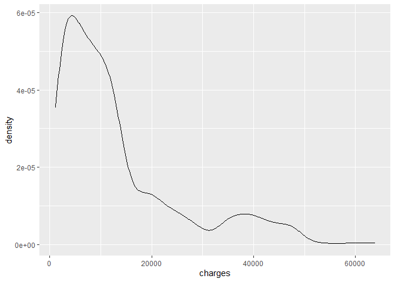<!-- -->

```r
density <- insurance_cost %>% 
  ggplot() +
  geom_density(aes(x = charges)) +
  scale_x_log10() +
  ylab(expression(bold(density))) +
  xlab(expression(bold(charges))) +
  geom_vline(aes(xintercept = charges_mean), color = "red") + #Вертикальная линия
  annotate("text", 
           x = charges_mean+8000, 
           y = 1.3, 
           color = "red",
           label=paste0("Mean=", charges_mean)) +
  geom_vline(
    aes(xintercept = charges_median), color = "green"
    ) + #Вертикальная линия
  annotate("text", 
           x = charges_median+5000, 
           y = 1.5, 
           color = "green",
           label = paste0("Median=", charges_median)
           ) +
    theme_minimal()+
    theme( # Ниже идут настройки тем (их огромное количество, но мы меняем лишь две)
    title = element_text(size = 12), # Задаем стандартный размер текста для любого элемента графика
    )
density
```

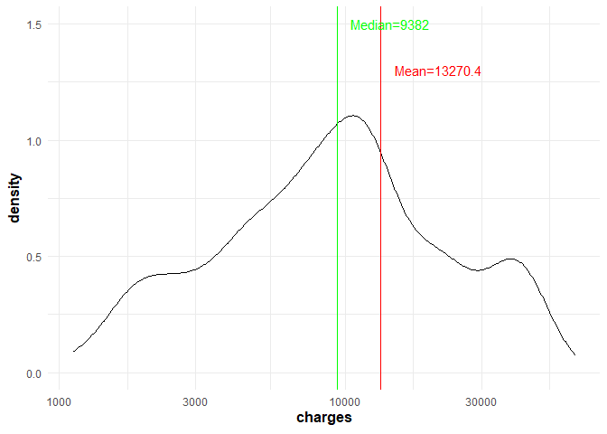<!-- -->

# 4. График box-plot по распределению уровня страховых выплат у мужчин/женщин; курильщиков/некурильщиков; людей проживающих в разных регионах 


```r
boxplot1 <- ggplot() +
  geom_boxplot(data = insurance_cost, 
               aes(x = charges, y = sex)) +
  theme_light() +
  labs(x = 'charges', y = 'sex') +
  theme( # Ниже идут настройки тем (их огромное количество, но мы меняем лишь две)
    title = element_text(size = 12), # Задаем стандартный размер текста для любого элемента графика
    axis.title.y = element_text(size=14) # Задаём размер для названия оси y отдельно + 
    )

boxplot2 <- ggplot() +
  geom_boxplot(data = insurance_cost, 
               aes(x = charges, y = smoker)) +
  theme_light() +
  labs(x = 'charges', y = 'smokers') +
  theme( # Ниже идут настройки тем (их огромное количество, но мы меняем лишь две)
    title = element_text(size = 12), # Задаем стандартный размер текста для любого элемента графика
    axis.title.y = element_text(size=14) # Задаём размер для названия оси y отдельно + 
    )

boxplot3 <- ggplot() +
  geom_boxplot(data = insurance_cost, 
               aes(x = charges, y = region)) +
  theme_light() +
  labs(x = 'charges', y = 'region') +
  theme( # Ниже идут настройки тем (их огромное количество, но мы меняем лишь две)
    title = element_text(size = 12), # Задаем стандартный размер текста для любого элемента графика
    axis.title.y = element_text(size=14) # Задаём размер для названия оси y отдельно + 
    )

boxplot1 
```

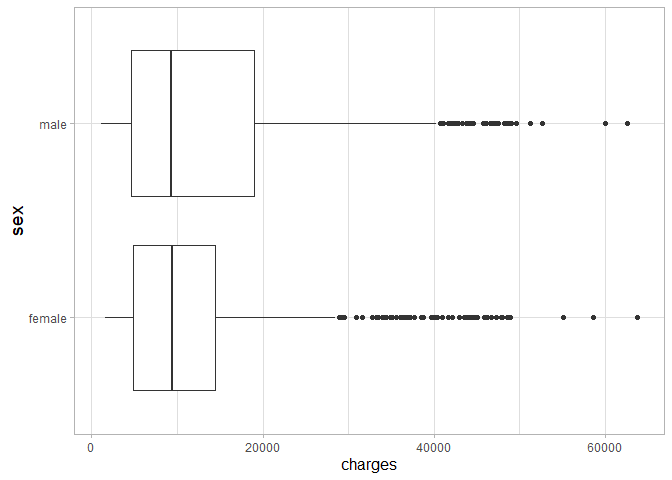<!-- -->

```r
boxplot2
```

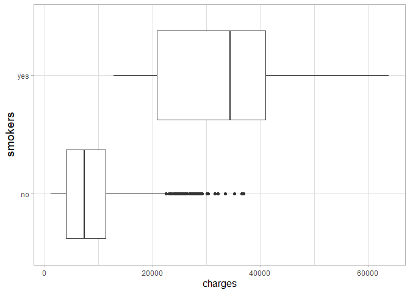<!-- -->

```r
boxplot3 
```

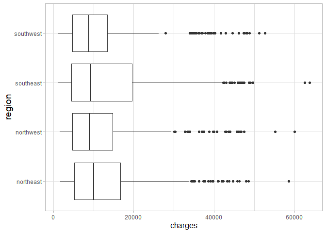<!-- -->

# 5. Объединение графиков, полученных в №3,4


```r
boxplot_united <- ggarrange(boxplot1, boxplot2, boxplot3, nrow = 1, ncol = 3)

combine_plot <- ggarrange(density, boxplot_united , nrow = 2, ncol = 1)

combine_plot <- annotate_figure(combine_plot, 
                top = text_grob("Распределение ур-ней страховых выплат \n в зависимости от различных факторов", face = "bold", size = 14))

combine_plot
```

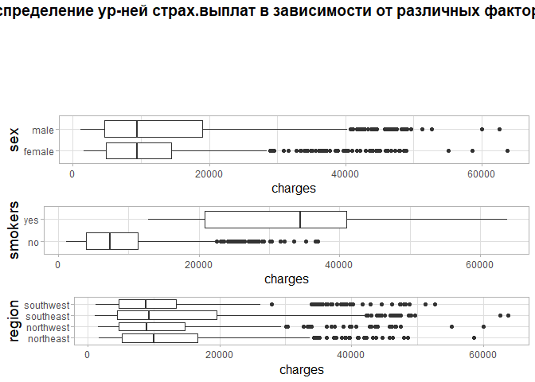<!-- -->

# 6. Фасет графика, полученного в №3 по колонке region

Фасеты это разбивка графика по какой-то категориальной переменной на два или больше графиков (в зависимости от числа категорий в переменной). В результате на каждом графике отображается подвыборка какого-то значения категории. 


```r
charges_by_region <- insurance_cost %>% 
  ggplot() +
  geom_density(aes(x = charges, fill = region), alpha = 0.5) +
  scale_x_log10() +
  theme(legend.position="none") +
  labs(x ="Charges") +
  facet_grid(. ~ region) +
  theme_minimal()

  
  
charges_by_region
```

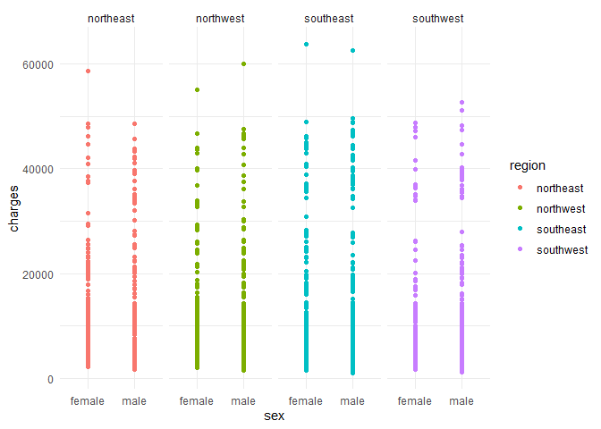<!-- -->

# 7-9. Scatter plot отношения переменных age и charges, добавляем колонку smoker


```r
scatter_plot1 <- insurance_cost %>% 
  #filter(mass != 0 & triceps != 0) %>% 
  ggplot(aes(x = age, y = charges, color = age)) + 
    geom_point(size=3) +
 theme_minimal() +
 ggtitle('Scatter plot отношения переменных возраста и выплат') +
 theme(axis.text.x = element_text(size = 14)) 

scatter_plot2 <- insurance_cost %>% 
  #filter(mass != 0 & triceps != 0) %>% 
  ggplot(aes(x = age, y = charges, color = age)) + 
    geom_point(size=3) +
 theme_minimal() +
 ggtitle('Scatter plot отношения переменных возраста и страховых выплат') +
 theme(axis.text.x = element_text(size = 14)) +
  geom_smooth(method=lm, # Выбираем модель. Стандартно - линейная модель
              color="red", fullrange = T,
              fill="#69b3a2", 
              se=TRUE) # Используем ли доверительные интервалы?

#9. Разбиваем предыдущий график по колонке smoker
scatter_plot3 <- insurance_cost %>% 
  #filter(mass != 0 & triceps != 0) %>% 
  ggplot(aes(
    x = age,
    y = charges,
    color = smoker,
    fill = smoker,
    group = smoker)) + 
    geom_point(size=3) +
  geom_smooth(method=lm, # Выбираем модель. Стандартно - линейная модель
              color="red", fullrange = T,
              fill="#69b3a2", 
              se=TRUE) + # Используем ли доверительные интервалы?
 theme_minimal() +
 ggtitle('Scatter plot отношения переменных возраста и страховых выплат') +
 theme(axis.text.x = element_text(size = 14))


scatter_plot1
```

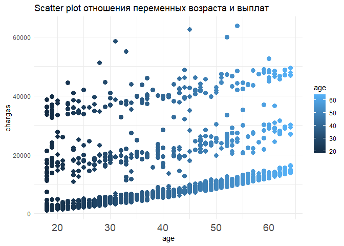<!-- -->

```r
scatter_plot2
```

```
## `geom_smooth()` using formula 'y ~ x'
```

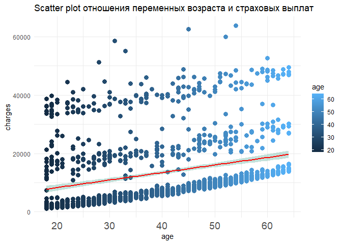<!-- -->

```r
scatter_plot3
```

```
## `geom_smooth()` using formula 'y ~ x'
```

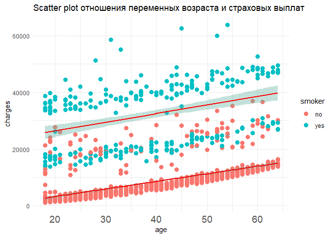<!-- -->


# 10. Scatter plot отношения переменных bmi и charges, добавляем колонку smoker


```r
scatter_plot4 <- insurance_cost %>% 
  #filter(mass != 0 & triceps != 0) %>% 
  ggplot(aes(x = bmi, y = charges, color = bmi)) + 
    geom_point(size=3) +
 theme_minimal() +
 ggtitle('Отношение переменных возраста и страховых выплат') +
 theme(axis.text.x = element_text(size = 14)) 

scatter_plot5 <- insurance_cost %>% 
  #filter(mass != 0 & triceps != 0) %>% 
  ggplot(aes(x = bmi, y = charges, color = bmi)) + 
    geom_point(size=3) +
 theme_minimal() +
 ggtitle('Отношение переменных возраста и страховых выплат') +
 theme(axis.text.x = element_text(size = 14)) +
  geom_smooth(method=lm, # Выбираем модель. Стандартно - линейная модель
              color="red", fullrange = T,
              fill="#69b3a2", 
              se=TRUE) # Используем ли доверительные интервалы?


 scatter_plot6 <- insurance_cost %>% 
  #filter(mass != 0 & triceps != 0) %>% 
  ggplot(aes(
    x = bmi,
    y = charges,
    color = smoker,
    fill = smoker,
    group = smoker)) + 
    geom_point(size=3) +
  geom_smooth(method=lm, # Выбираем модель. Стандартно - линейная модель
              color="red", fullrange = T,
              fill="#69b3a2", 
              se=TRUE) + # Используем ли доверительные интервалы?
 theme_minimal() +
 ggtitle('Отношение перем. возраста и страх.выплат для курящих/некурящих') +
 theme(axis.text.x = element_text(size = 14))

scatter_plot4
```

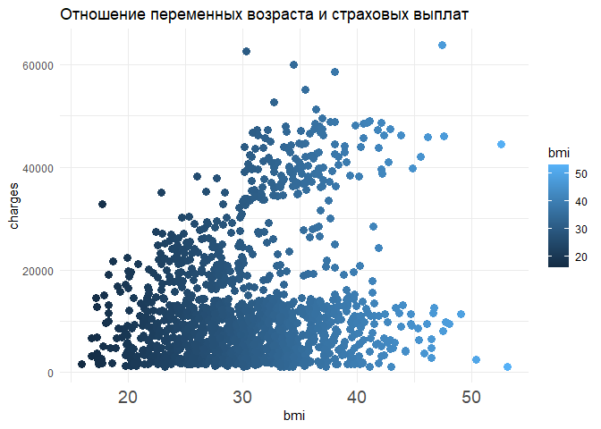<!-- -->

```r
scatter_plot5
```

```
## `geom_smooth()` using formula 'y ~ x'
```

<!-- -->

```r
scatter_plot6
```

```
## `geom_smooth()` using formula 'y ~ x'
```

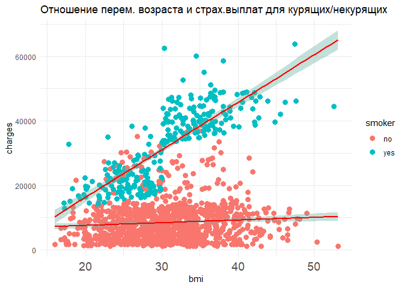<!-- -->


# 11. Вопрос к данным №1. Какой поло-возрастной состав анализируемый выборки?

**Цель:**   
определить поло-возрастной состав данных с целью оценки репрезентативности выборки, а также оценки применимости результатов анализа на других индивидуумах.

**Обоснование:** 
violin plot наиболее наглядно показывает, есть ли какие-то перекосы в выборке по возрасту, 
а также позволяет наглядно увидеть распределение возрастов среди мужчин и женщин независимо.


```r
sex_age_violin <- ggplot(insurance_cost) +
  geom_violin(aes(x = sex, y = age, color = sex, fill = sex), 
              trim = FALSE) + 
  ggtitle('Поло-возрастной состав')

sex_age_violin
```

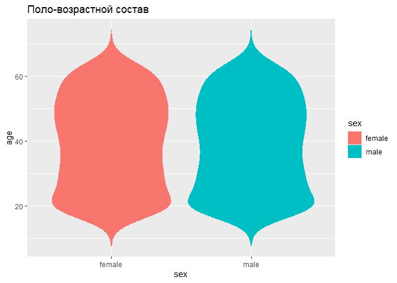<!-- -->

# 12. Вопрос к данным №2.По каким возрастным категориям больше всего страховых выплат у страховой компании?

Cделаем переменную возрастных категорий:


```r
insurance_cost_new <- insurance_cost %>% 
mutate(age_group = case_when(
  insurance_cost$age < 30 ~ "18-29",
  insurance_cost$age >= 30 & age < 45 ~ "30-44",
  insurance_cost$age >= 45 ~ "45+"))

summary(insurance_cost_new)
```

```
##       age            sex           bmi           children     smoker    
##  Min.   :18.00   female:662   Min.   :15.96   Min.   :0.000   no :1064  
##  1st Qu.:27.00   male  :676   1st Qu.:26.30   1st Qu.:0.000   yes: 274  
##  Median :39.00                Median :30.40   Median :1.000             
##  Mean   :39.21                Mean   :30.66   Mean   :1.095             
##  3rd Qu.:51.00                3rd Qu.:34.69   3rd Qu.:2.000             
##  Max.   :64.00                Max.   :53.13   Max.   :5.000             
##        region       charges       age_group        
##  northeast:324   Min.   : 1122   Length:1338       
##  northwest:325   1st Qu.: 4740   Class :character  
##  southeast:364   Median : 9382   Mode  :character  
##  southwest:325   Mean   :13270                     
##                  3rd Qu.:16640                     
##                  Max.   :63770
```

```r
table(insurance_cost_new$age_group)
```

```
## 
## 18-29 30-44   45+ 
##   417   392   529
```

Построим график типа histogram для оценки количества и размера выплат у разных возрастных групп. 

**Обоснование:** 
этот тип графика позволяет ответить на вопрос, у какой возрастной категории больше выплат, а также позволяет сравнить разыне возрастные категории по размеру выплат.


```r
ggplot() +
  geom_histogram(data = insurance_cost_new, 
               aes(x = charges, fill = age_group), alpha = 0.5) +
  theme_minimal()
```

```
## `stat_bin()` using `bins = 30`. Pick better value with `binwidth`.
```

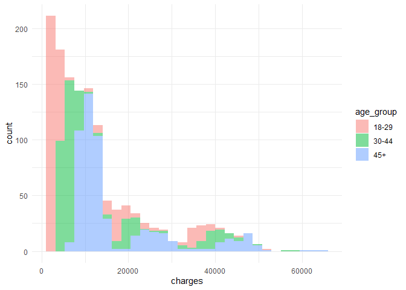<!-- -->

**Обоснование:** 
построим график типа density, чтобы "сгладить" углы.

```r
ggplot() +
  geom_density(data = insurance_cost_new, 
               aes(x = charges, fill = age_group), 
               alpha = 0.5 # Показатель альфа указывает насколько прозрачным должно быть отображение фигур. Измеряется от 0 до 1.
               ) +
  theme_minimal()
```

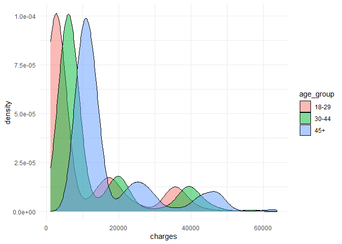<!-- -->
